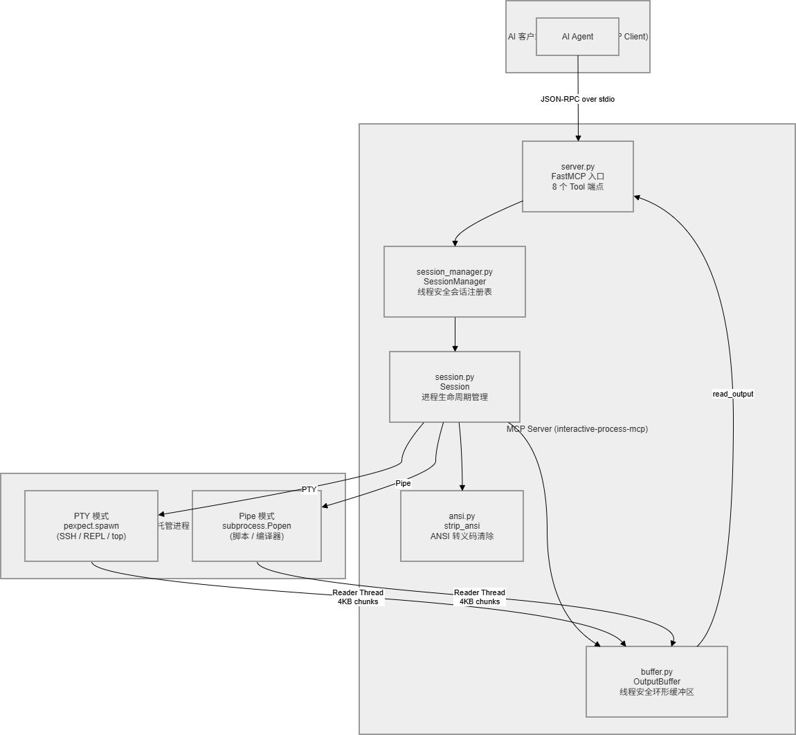
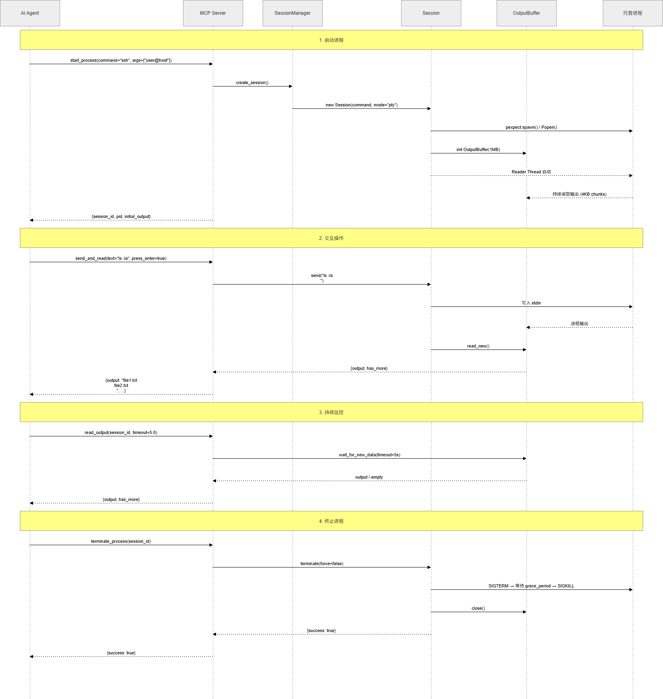
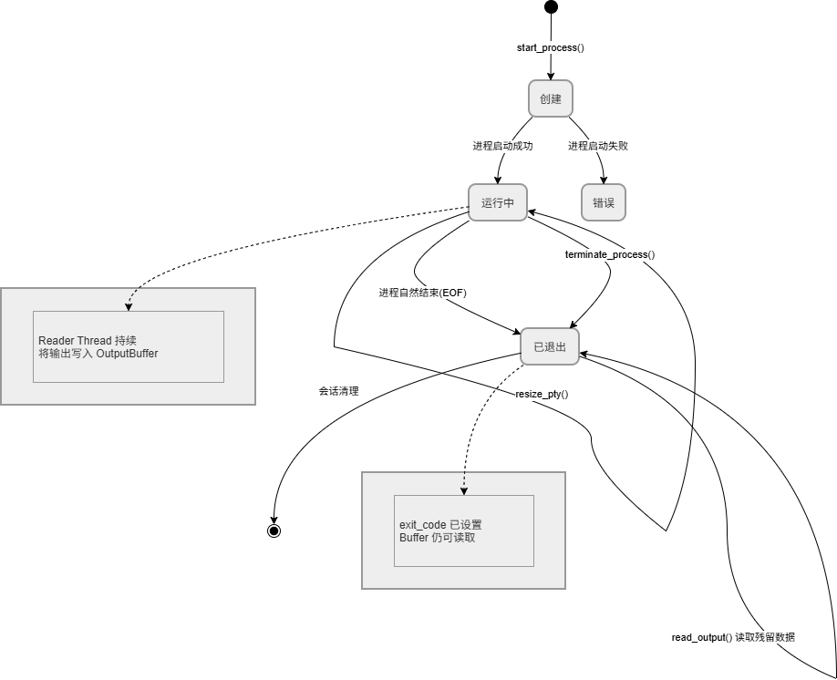

# interactive-process-mcp

<p align="center">
  <strong>让 AI Agent 拥有交互式终端能力</strong>
</p>

<p align="center">
  
  
  
  
</p>

<p align="center">
  <strong>中文</strong> | <a href="./README.md">English</a>
</p>

---

## 项目介绍

`interactive-process-mcp` 是一个基于 MCP (Model Context Protocol) 协议的服务端，让 AI Agent（如 Claude Code）能够启动、操控和管理**长时间运行的交互式进程**。

### 为什么需要它？

AI Agent 原生只能执行一次性命令——执行完毕后立刻返回结果。但现实中大量场景需要**多轮交互**：

- SSH 到远程服务器，先输密码，再执行命令
- Python REPL 中逐行调试代码
- 交互式安装程序中回答 `[Y/n]` 提示
- 使用 `top`、`htop` 等需要终端的命令
- 运行安全工具（如 impacket）进行多步骤操作

这些场景下，进程持续运行，AI Agent 需要在**多个对话轮次中反复读写**进程的输入输出。`interactive-process-mcp` 正是为此而设计的桥梁。

### 核心特性

| 特性 | 说明 |
|------|------|
| **PTY 和 Pipe 双模式** | PTY 模式模拟真实终端（SSH、top、安装器等均可正常运行）；Pipe 模式适用于简单 stdin/stdout 交互 |
| **多会话管理** | 同时管理多个独立进程，互不干扰 |
| **ANSI 转义码清除** | 可选自动去除终端控制序列，AI Agent 获得纯净文本 |
| **非阻塞读取** | Agent 按自己的节奏读取输出，超时返回空而非报错 |
| **原子发送读取** | `send_and_read` 一步完成发送 + 读取 |
| **优雅终止** | 先 SIGTERM，等待可配置宽限期后再 SIGKILL |
| **PTY 尺寸调整** | 运行时动态调整终端行列数 |

---

## 架构设计

### 模块结构

```
src/interactive_process_mcp/
├── server.py            # FastMCP 入口，注册 8 个 Tool 端点
├── session_manager.py   # SessionManager — 线程安全会话注册表
├── session.py           # Session — 进程生命周期管理（PTY/Pipe 双模式）
├── buffer.py            # OutputBuffer — 线程安全环形缓冲区（1MB）
├── ansi.py              # strip_ansi — 正则清除 ANSI 转义码
├── tools.py             # 可选的独立 Tool 处理层（测试用）
├── __init__.py
└── __main__.py          # python -m 入口
```

### 数据流架构



**关键设计决策：**

1. **环形缓冲区（Ring Buffer）**：每个会话维护一个最大 1MB 的输出缓冲区。Reader Thread 持续将进程输出以 4KB 块写入缓冲区；Agent 通过 `read_output` 按需消费。已消费的数据自动清理，超出容量时丢弃最早的块。

2. **线程模型**：主线程处理 MCP JSON-RPC 请求；每个 Session 拥有独立的 daemon Reader Thread，负责将进程输出持续泵入缓冲区。线程间通过 `threading.Lock`（互斥）和 `threading.Event`（新数据通知）协调。

3. **双模式进程管理**：PTY 模式使用 `pexpect.spawn`（模拟真实终端，支持光标操作、颜色输出）；Pipe 模式使用 `subprocess.Popen`（更轻量，适用于非交互程序）。

---

## 工作流

### 完整交互流程



**步骤详解：**

1. **启动进程** — 调用 `start_process`，创建 Session、启动进程、初始化 Reader Thread，返回 `session_id` 和初始输出
2. **交互操作** — 通过 `send_input` / `send_and_read` 向进程发送文本，`press_enter` 可自动追加换行
3. **读取输出** — 调用 `read_output` 消费缓冲区中的新数据，支持超时等待和行数限制
4. **状态监控** — `list_sessions` 查看所有会话，`get_session_info` 获取单个会话详情
5. **终止进程** — `terminate_process` 优雅关闭（SIGTERM → 等待 → SIGKILL）

### 会话生命周期



- **创建**：`start_process()` 成功后进入运行状态
- **运行中**：可反复执行读写操作和 PTY 调整
- **已退出**：进程自然结束或被终止；`exit_code` 已设置，缓冲区残余数据仍可读取

---

## 效果示例

### 示例 1：SSH 远程操作

```
AI Agent 操作流程                              进程输出
─────────────────                              ────────────────

start_process(
  command="ssh",
  args=["deploy@192.168.1.100"],
  mode="pty"
)
                                    ←    "deploy@192.168.1.100's password: "

send_and_read(
  text="my_secret_pass",
  press_enter=true
)
                                    ←    "Welcome to Ubuntu 22.04 LTS
                                          Last login: Fri Apr 25 10:30:00 2026
                                          deploy@web-server:~$ "

send_and_read(
  text="df -h",
  press_enter=true
)
                                    ←    "Filesystem      Size  Used Avail Use% Mounted on
                                          /dev/sda1       100G   45G   55G  45% /
                                          deploy@web-server:~$ "

send_and_read(
  text="sudo systemctl restart nginx",
  press_enter=true
)
                                    ←    "[sudo] password for deploy: "

send_and_read(
  text="deploy_password",
  press_enter=true
)
                                    ←    "deploy@web-server:~$ "

terminate_process(session_id="abc123")
                                    →    进程终止
```

### 示例 2：Python REPL 调试

```
start_process(command="python3", mode="pty")
                                    ←    "Python 3.10.12\n>>> "

send_and_read(text="data = [1, 2, 3, 4, 5]", press_enter=true)
                                    ←    ">>> "

send_and_read(text="sum(data)", press_enter=true)
                                    ←    "15\n>>> "

send_and_read(text="[x**2 for x in data]", press_enter=true)
                                    ←    "[1, 4, 9, 16, 25]\n>>> "
```

### 示例 3：多会话并行管理

```
# 同时运行多个独立进程
start_process(command="ping", args=["-c", "5", "google.com"], name="ping-test")
  → session_id: "a1b2c3"

start_process(command="python3", args=["-m", "http.server", "8080"], name="web-server")
  → session_id: "d4e5f6"

start_process(command="tail", args=["-f", "/var/log/syslog"], name="log-monitor")
  → session_id: "g7h8i9"

# 查看所有会话状态
list_sessions()
  → sessions: [
      {id: "a1b2c3", name: "ping-test",    status: "running", pid: 12345},
      {id: "d4e5f6", name: "web-server",   status: "running", pid: 12346},
      {id: "g7h8i9", name: "log-monitor",  status: "running", pid: 12347}
    ]

# 按需读取各个会话的输出
read_output(session_id="a1b2c3")  → ping 统计信息
read_output(session_id="g7h8i9")  → 最新日志

# 完成后终止
terminate_process(session_id="a1b2c3")
terminate_process(session_id="d4e5f6")
terminate_process(session_id="g7h8i9")
```

---

## 工具参考

### `start_process`

启动一个交互式进程。

| 参数 | 类型 | 必填 | 默认值 | 说明 |
|------|------|------|--------|------|
| `command` | string | 是 | — | 要执行的命令 |
| `args` | string[] | 否 | `[]` | 命令参数 |
| `mode` | "pty" \| "pipe" | 否 | `"pty"` | I/O 模式 |
| `name` | string | 否 | 自动生成 | 会话名称 |
| `cwd` | string | 否 | 继承 | 工作目录 |
| `env` | object | 否 | 继承 | 环境变量 |
| `timeout` | number | 否 | `10` | 启动超时（秒） |
| `rows` | integer | 否 | `24` | PTY 行数 |
| `cols` | integer | 否 | `80` | PTY 列数 |

返回：`{ session_id, pid, initial_output }`

### `send_input`

向进程发送文本。

| 参数 | 类型 | 必填 | 默认值 | 说明 |
|------|------|------|--------|------|
| `session_id` | string | 是 | — | 会话 ID |
| `text` | string | 是 | — | 要发送的文本 |
| `press_enter` | boolean | 否 | `false` | 是否追加换行 |

### `read_output`

读取上次读取后的新输出。无新输出时等待最多 `timeout` 秒，超时返回空。

| 参数 | 类型 | 必填 | 默认值 | 说明 |
|------|------|------|--------|------|
| `session_id` | string | 是 | — | 会话 ID |
| `strip_ansi` | boolean | 否 | `true` | 是否清除 ANSI 转义码 |
| `timeout` | number | 否 | `5` | 等待时间（秒） |
| `max_lines` | integer | 否 | `0` | 最大行数（0 = 无限） |

返回：`{ output, has_more, lines_returned, bytes_returned }`

### `send_and_read`

原子操作：发送输入 + 等待 + 读取输出。参数为 `send_input` 和 `read_output` 的合集。

### `list_sessions`

列出所有会话。返回：`{ sessions: [...] }`

### `terminate_process`

终止进程。

| 参数 | 类型 | 必填 | 默认值 | 说明 |
|------|------|------|--------|------|
| `session_id` | string | 是 | — | 会话 ID |
| `force` | boolean | 否 | `false` | 是否直接 SIGKILL |
| `grace_period` | number | 否 | `5` | SIGTERM 后等待秒数 |

### `resize_pty`

调整 PTY 尺寸（仅 PTY 模式）。

| 参数 | 类型 | 必填 | 默认值 | 说明 |
|------|------|------|--------|------|
| `session_id` | string | 是 | — | 会话 ID |
| `rows` | integer | 否 | `24` | 行数 |
| `cols` | integer | 否 | `80` | 列数 |

### `get_session_info`

获取会话详情。返回：`{ id, name, command, args, mode, status, exit_code, pid, created_at }`

---

## 安装

```bash
pip install -e .
```

开发模式（包含测试依赖）：

```bash
pip install -e ".[dev]"
```

**要求：** Python >= 3.10 / Linux

## 配置

### Claude Code

方式一 — CLI 命令：

```bash
claude mcp add --scope user interactive-process -- interactive-process-mcp
```

方式二 — 配置文件（`.claude/settings.json` 或 `.mcp.json`）：

```json
{
  "mcpServers": {
    "interactive-process": {
      "command": "interactive-process-mcp"
    }
  }
}
```

方式三 — 从源码运行：

```json
{
  "mcpServers": {
    "interactive-process": {
      "command": "python",
      "args": ["-m", "interactive_process_mcp"]
    }
  }
}
```

### 其他 MCP 客户端

任何支持 stdio 传输的 MCP 客户端均可使用。入口点：

```bash
interactive-process-mcp
# 或
python -m interactive_process_mcp
```

---

## 测试

```bash
pip install -e ".[dev]"
pytest tests/ -v
```

测试覆盖 42 个用例，涵盖 ANSI 清除、环形缓冲区、会话生命周期（PTY 和 Pipe 模式）、会话管理器和 Tool 集成。

## 图表资源

架构图、工作流时序图和会话生命周期图可在 `docs/` 目录中找到，使用浏览器打开 HTML 文件即可在 draw.io 中编辑。

## License

MIT
